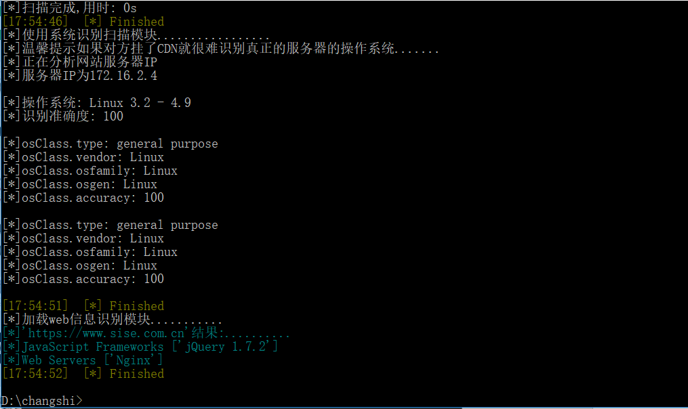

**web简单扫描器（feidao）**

前言:一开始是主要是收集poc，然后后期在漏洞复现的时候锻炼写poc的水平，还有exp的水平。但是想想能不能在实现poc和exp功能的前提下又能增加平时信息收集的功能,为此写了适合自己的python工具.由于期末考试，还有很多课程的课设问题,sql扫描插件,xss,ur爬取等很多功能并没有实现.这个会在后期有空的时候更新

**声明:如果利用此工具做违法事情本人一概不负责任，主要的是交流分享**

1.工具介绍
==========

web信息收集器（feidao）是一款终端交互式安全扫描工具，主要是面对安全人员的。

1.1功能特性:
------------

信息收集方面:

-   主要实现web指纹识别，包括使用的脚本语言,使用的web服务器,cdn识别

-   whois查询, 备案信息查询

-   子域名的查询(子域名查询只能针对外网,因为使用的是API接口)

-   调用nmap识别操作系统

-   扫描存在的C段

-   IP的开放端口信息

POC（验证漏洞是否存在的代码）方面:

-   实现漏洞的验证

EXP（当漏洞存在的时候使用exp模块进行渗透）:

-   针对已存在的漏洞进行攻击

2.运行环境:
===========

python3

2.1Requirements:
----------------

-   colorama

-   argparse

-   importlib

-   colorlog

-   logging

-   base64

-   requests

-   json

-   re

-   lxml

3.模块划分:
===========

├─feidao.py 主文件入口

├─lib目录 核心文件

│ ├─cli.py 终端命令加载对应的模块

│ ├─cmdline.py 使用argparse实现命令行解析

│ ├─data.py 实例化终端输出对象

│ ├─log.py 使用logging模块实现终端信息的输出

│ ├─loader.py 最核心部分实现对应模块的加载

├─plugins目录 存放验证漏洞的POC脚本目录

├─scanner目录 实现信息收集的模块

│ ├─C.py 实现IP段的C段扫描 例如扫描172.16.134.xxx/24的网段

│ ├─os.py 利用nmap实现操作系统的识别

│ ├─port.py 扫描1-65535对应端口的开放

│ ├─web.py 利用whatweb API接口实现web指纹识别(使用的脚本语言,web系统，框架等)

│ ├─whois.py 利用138.com网站实现whois查询(dns信息,备案信息…),子域名查询

├─data目录 存放对应IP或者域名扫描的信息

├─agent

│ ├─user_agent_list.py 实现随机user_agent的生成

├─exp目录 当确认存在漏洞时候利用exp实现渗透

├─shell目录 一些语言的反弹shell(目前有jsp,php)

│ ├─nc.py 实现反弹shell后连接

3.1主要核心文件的介绍:
======================

3.1.1 loader.py实现模块的加载
-----------------------------

**def loadPlugin(url, poc=None, sca=None, ex=None):**

实现终端命令参数解析后传递到loadPlugin进行判断加载对应的模块

**def load_exp_or_plugin(url,poc = None, exp = None):**

因为poc和exp模块的后续脚本不断增加,实现判断加载是poc还是exp模块

**def isDir(plugin_path):**

判断加载的模块是否是目录

**def jiazai(url, items, pay, dirname):**

加载对应模块下的文件,如果没有选定就是加载所有,使用load函数实现多线程调度,如果加载的是指定的单一脚本就是使用单线程

4. 参数解析

3.1.2 cli.py实现终端解析后的参数传递给核心加载模块loader.py
-----------------------------------------------------------

3.1.3 cmdline.py实现与用户终端的交互
------------------------------------

主要实现是使用argparse模块

3.1.4 log.py是实现终端信息的输出
--------------------------------

使用colorlog库实现自定义的级别对应不同颜色的输出

4.参数解析
==========

信息收集扫描模块:

\-u 是指定对应的网址或者IP，请以*http://开头，如果只是指定了-u参数默认是加载pluging的poc验证模块* 例如python feidao.py -u <http://www.sise.com.cn>
--------------------------------------------------------------------------------------------------------------------------------------------------

\-s 是信息收集模块
------------------

\-s port 扫描对应IP开放的端口
-----------------------------

会在data目录生成对应的信息

\-s whois收集whois信息和子域名信息（只能只对外网）
--------------------------------------------------

\-s c 扫描IP地址的C段，看看哪些地址开放了
-----------------------------------------

\-s os识别操作系统
------------------

\-s web识别网站的web信息（只能针对外网）
----------------------------------------

\-s all 扫描端口开放信息,whois,子域名,c段，操作系统识别,web指纹识别
-------------------------------------------------------------------

plugins（POC模块）
------------------

POC大部分是收集别人的,thinkphp5.0.23和tomcat_cve-2017-12615是自己重写的

如果确定了信息可以指定poc进行扫描

例如我这里搭建了windows靶机上面装有thinkphp5.0.23

利用-m参数指定使用thinkphp进行扫描

再如一个搭建了tomcat存在漏洞的网站

如果没有指定对应的poc也就是没指定-m参数是默认扫描全部的

5. exp（漏洞利用模块）
======================

exp模块只是写了thinphp5.0.23和tomcat_cve-2017-12615的exp，后期更新....

\-e 你要选择的渗透脚本

比如这里我们确定thinkphp5.0.23存在漏洞

这样你就可以想执行你想要的操作命令

比如创建一个用户留下后门

在比如在Linux下布置了tomcat,存在漏洞

靶机的终端

参考：
======

核心文件是参考 <https://github.com/b4zinga/lance>
